# README

本仓库用于存储和更新本人制作的各种没有任何实际作用或者有一点实际作用但是作用不大只能做摆件的PCB设计，或简言之，PCB怪板子作品集。

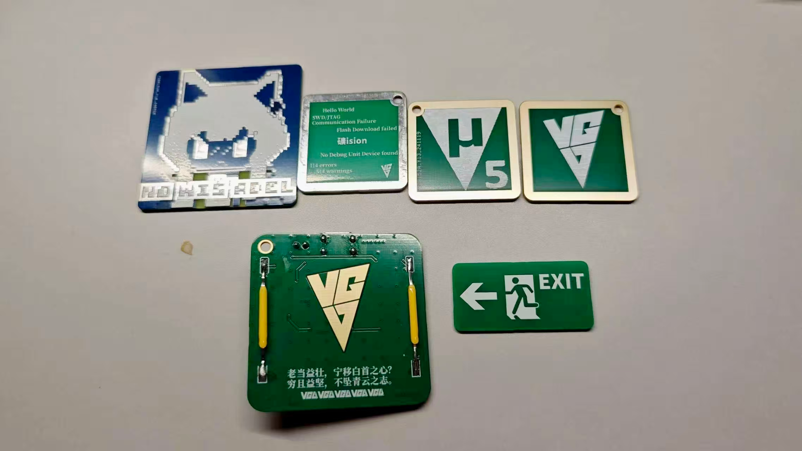

各项目后续可能同步到立创开源硬件平台上。

> 「兄啊，给我物板傻风牌的PCB」
>
> 「下两颗100nF、三个TypeC、四条陶瓷灯丝」
>
> 「再放个怪浪怪浪的丝印」

## 文件结构

```
├── hardware/			# 硬件文件
│   └──<各项目名称>
│   │   ├── image/		# 项目涉及图片文件&PSD文件
│   │   ├── LCEDA/		# 立创EDA工程文件
│  ...  └── gerber/		# gerber制板文件
├── assets/				# 图片
└── README.md			# 项目说明
```

对此项目进行贡献的用户请也按照此结构进行整理

## 项目介绍

### 迷迭香NO WIS'ADEL

实物展示：

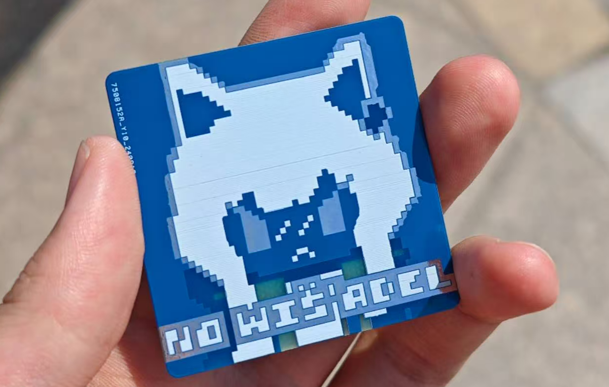

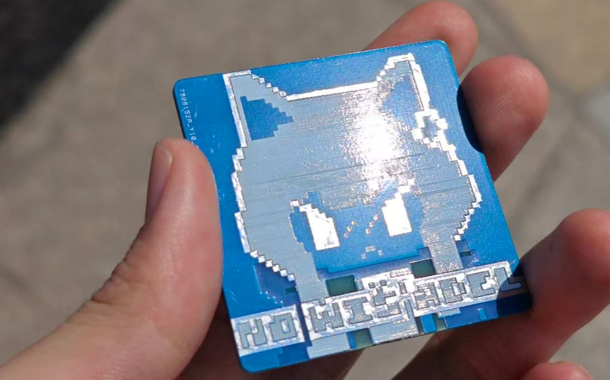

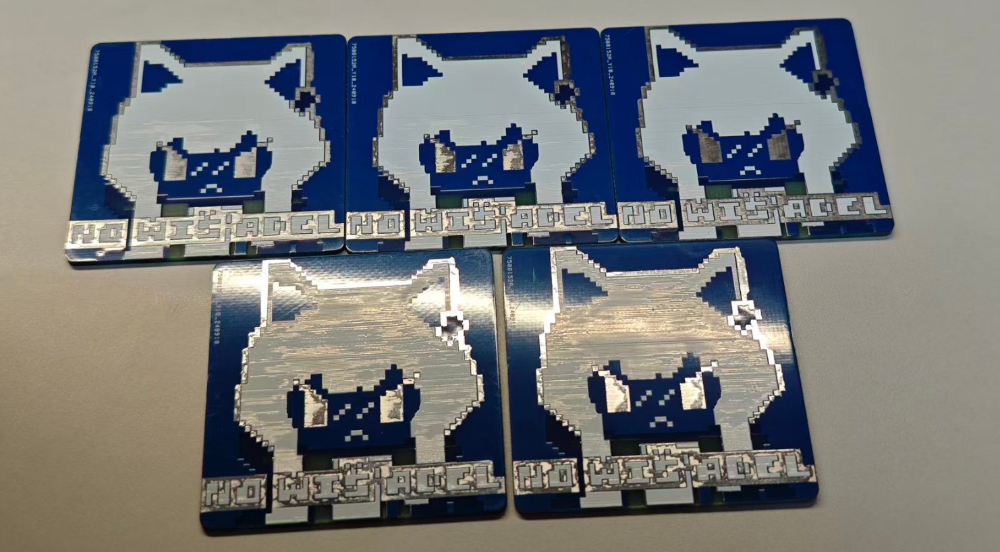

工程文件展示：


> 制作日期：2024.09

### 便携安全出口指示牌Exit

实物展示：


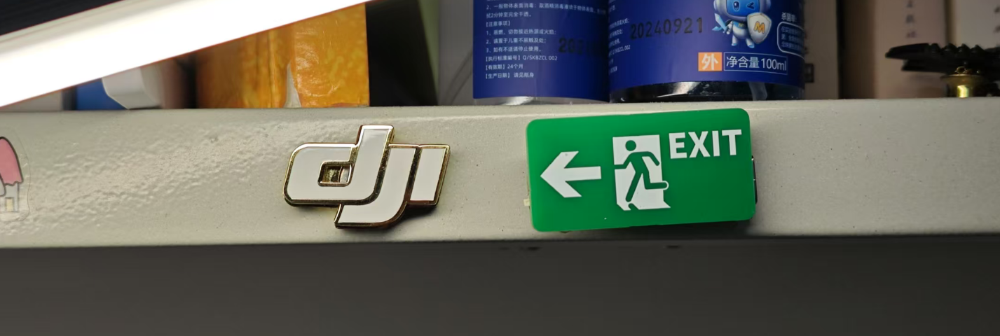

工程文件展示：

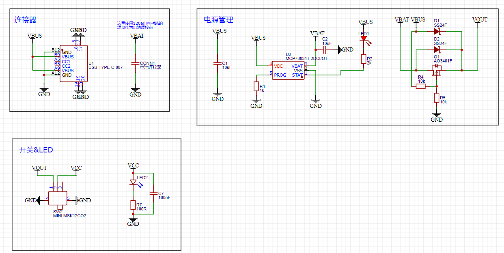

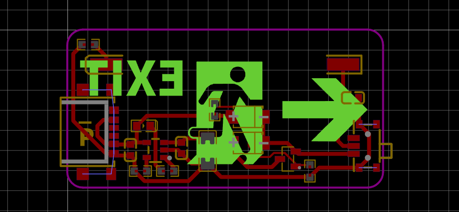

> 制作时间：2024.11
>
> 该板设计了简单的电池管理和陶瓷LED灯丝，但背光点亮效果并不好。

### 小夜灯VGD_light

实物展示：


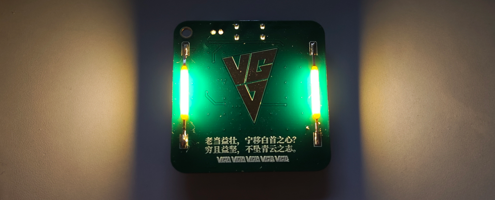

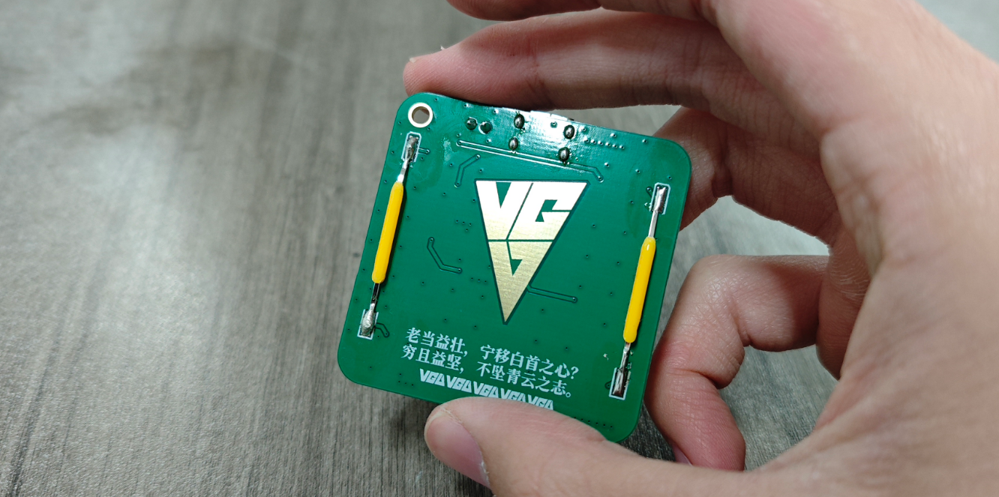

工程文件展示：

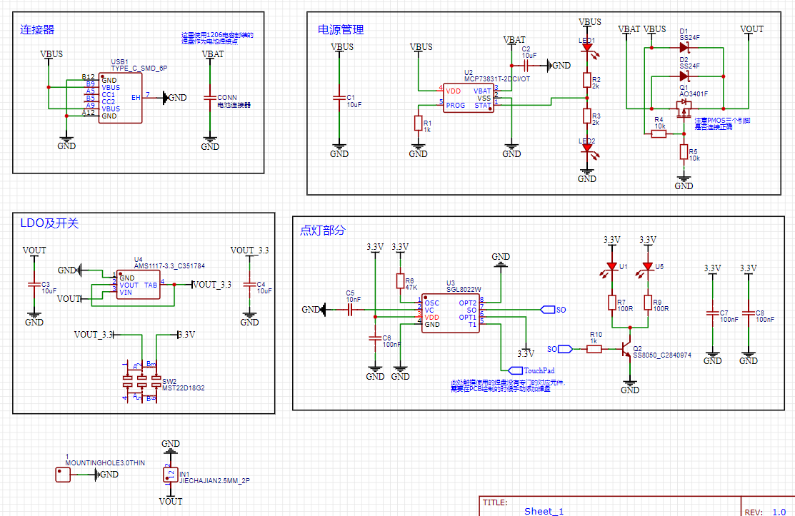

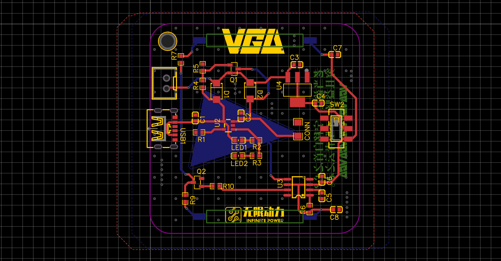

> 制作日期：2024.11
>
> 其实刚才那个紧急出口的电路就是从这里搬的……
>
> 小夜灯电路包括电池管理、触控电路、陶瓷LED灯丝；是设计来给硬件新同学考核的项目。

### Keil牌牌

实物展示：

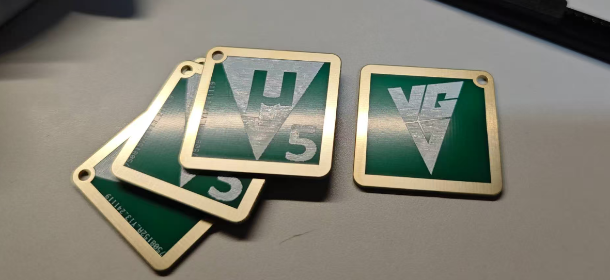

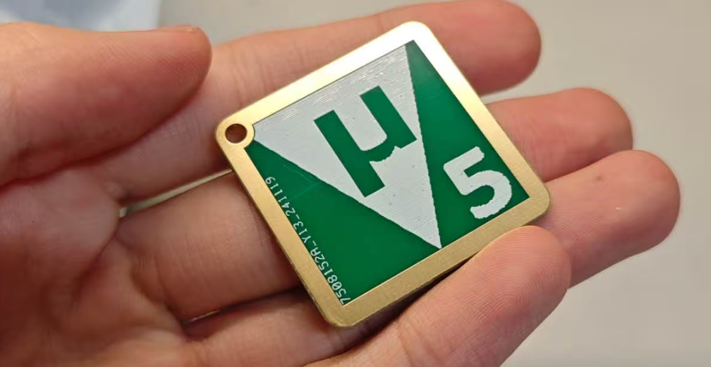

工程文件展示：

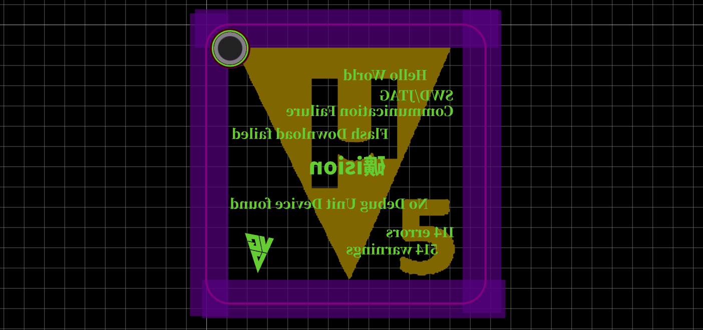

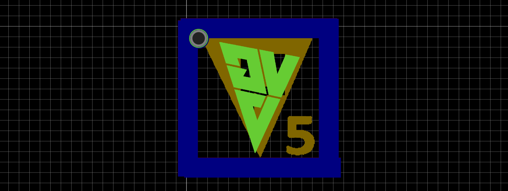

> 制作日期：2024.11
>
> 这个东西应该蛮多人做的……不过我做了VGD标的版本，和背后的弹幕云。

### 大炎通宝

实物展示：

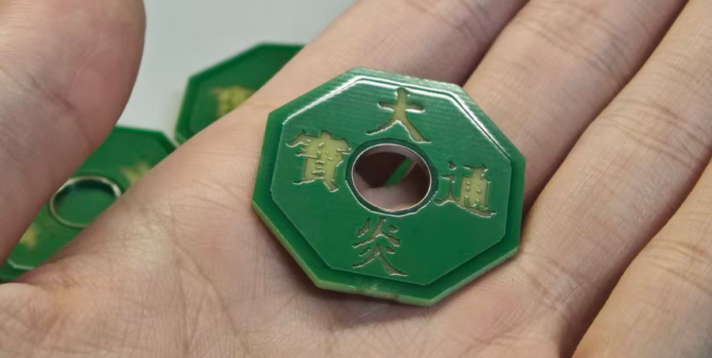

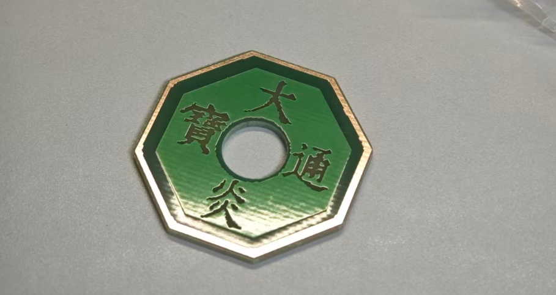

工程文件展示：

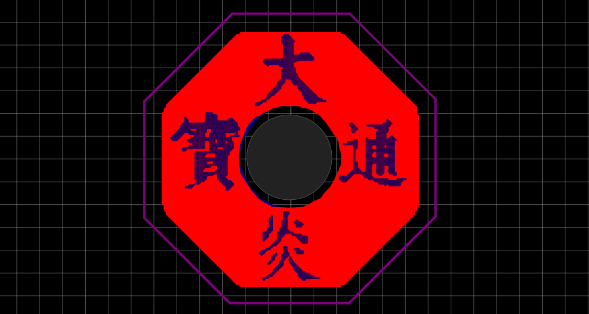

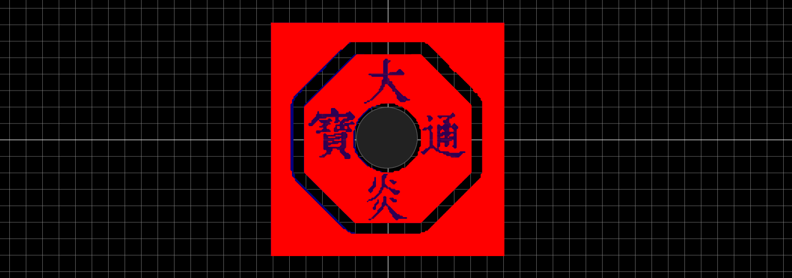

> 制作日期：2025.09
>
> 目前做了大炎通宝和投木延炎两个版本

## PCB_QSL - from BI7KHI
提交者：[BI7KHI](https://github.com/BI7KHI)

实物展示：

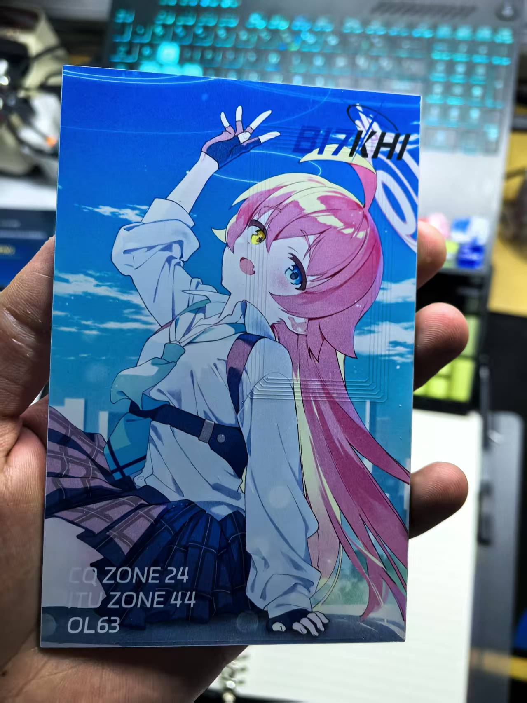

视频展示小破站链接：
[PCB_QSL-BY BI7KHI](https://www.bilibili.com/video/BV14rZmYYEZ2/?spm_id_from=333.1387.upload.video_card.click)

## VGD圣诞树NFC板

实物展示：


> 制作日期：2026.01
>
> 使用NT3H1101W0FHKH芯片。